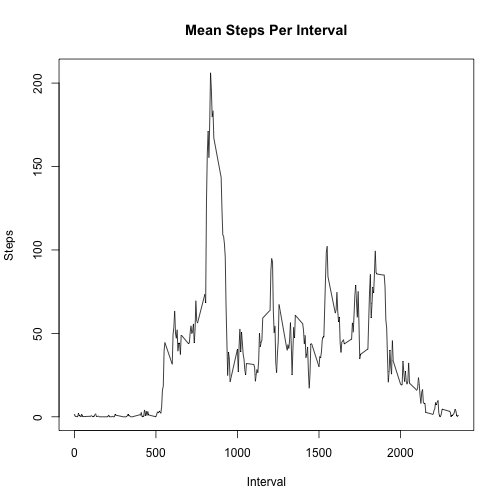

---
# Assignment 1

## Exploring data from fitness tracker on number of steps

Read the Data

Assume that the data is in the current directory and create a data set that removes rows with missing values


```r
setwd("courser5 probject 1" )

data1 <- read.csv("activity.csv")
data2 <- subset(data1, data1$steps != "NA")
```

Here is a histogram of the number of steps per day

 

Calculating mean and median number of steps per day


```r
meansteps <- mean(st$x)

mediansteps <- median(st$x)
```

The median number of steps per day is 10765

The mean number of steps per day is 1.0766189 &times; 10<sup>4</sup>

Here is a plot of the mean steps per time interval

 


Finding the interval with the maximum number of average steps

```r
maxs <- which.max(st2$x)
maxs <- which.max(st2$x)
maxint <- st2$category[maxs]
maxsteps <- max(st2$x)
```
The maximum number of average steps per interval is 206.1698113

Which occurs in the interval 835


```r
misingd <- nrow(data1)-nrow(data2)
```
The original data had 2304 rows missing the steps data


Now we will replace missing data on steps with the mean number of steps for that time interval

```r
data5 <- data1
for (i in 1: nrow(data5)) {
  if (is.na(data5$steps[i])) data5$steps[i] <- (subset(st2, st2$category == data5$interval[i]))$x
} 
```
And redo the histogram using the filled in dataset

Note that there are small changes in the histogram

```r
totalst <- aggregate(data5$steps, by=list(category=data5$date), FUN = sum)
hist(totalst$x, main= "Histogram of Steps Per Day, filled in data", xlab = "Steps Per Day")
```

 

Recalculating mean and median steps per day using the filled in dataset.

Note that the mean does not change, but the median does.


```r
meansteps2 <- mean(totalst$x)
mediansteps2 <- median(totalst$x)
```

The mean number of steps per day using the filled in data is 1.0766189 &times; 10<sup>4</sup>

The median number of steps per day using the filled in data is 1.0766189 &times; 10<sup>4</sup>

Is there a different pattern of steps on the weekend verus weekdays?

Assigning the weekday to the filled in dataset and creating separate sets for weekend
and weekday


```r
data5$day <- weekdays(as.Date(data5$date))
for ( i in 1:nrow(data5))  {
if( data5$day[i] =="Sunday" || data5$day[i] =="Saturday") data5$dc[i] <- "weekend" else
  data5$dc[i] <- "weekday"
}
dataend <- subset(data5, data5$dc == "weekend")
dataday <- subset(data5, data5$dc == "weekday")
```

Creating plots of weekend and weekday steps by time interval


```r
st5a <- aggregate(dataend$steps, by = list(category =dataend$interval), FUN = mean)
st5b <- aggregate(dataday$steps, by = list(category =dataday$interval), FUN = mean)
par(mfrow = c(2,1))
plot(st5a$category, st5a$x, type ="l", main ="Weekend Mean Steps Per Interval", xlab =
       "Interval", ylab = "Steps")


plot(st5b$category, st5b$x, type ="l", main ="Weekday Mean Steps Per Interval", xlab =
       "Interval", ylab = "Steps")
```

 
